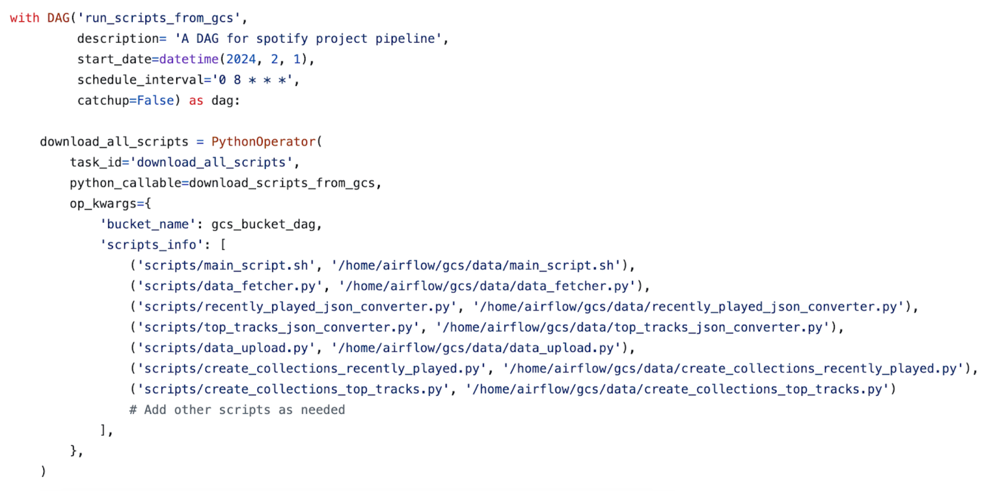
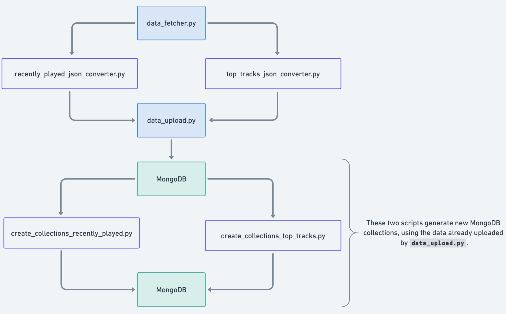
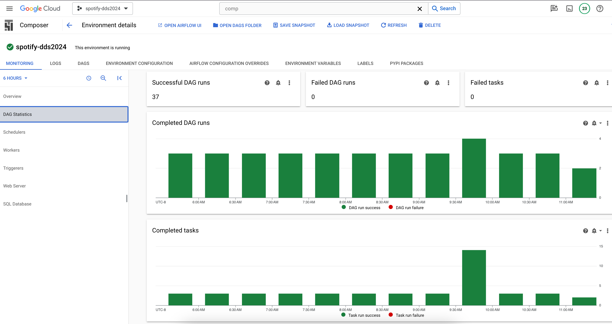
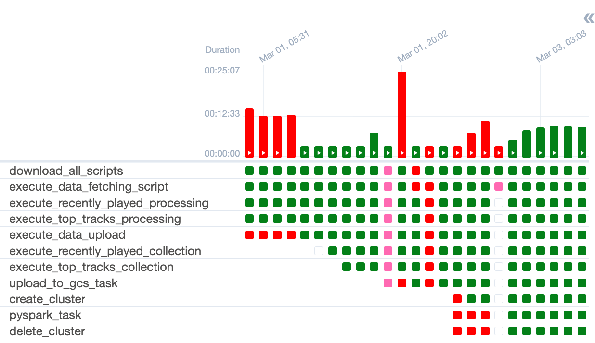
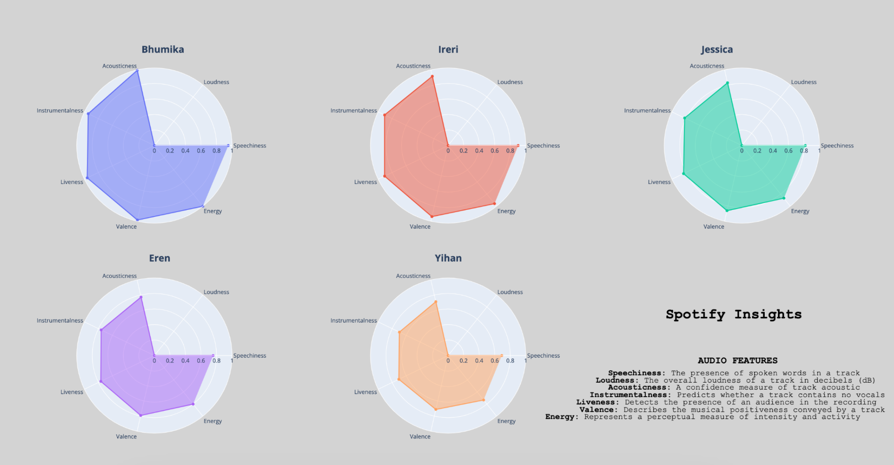
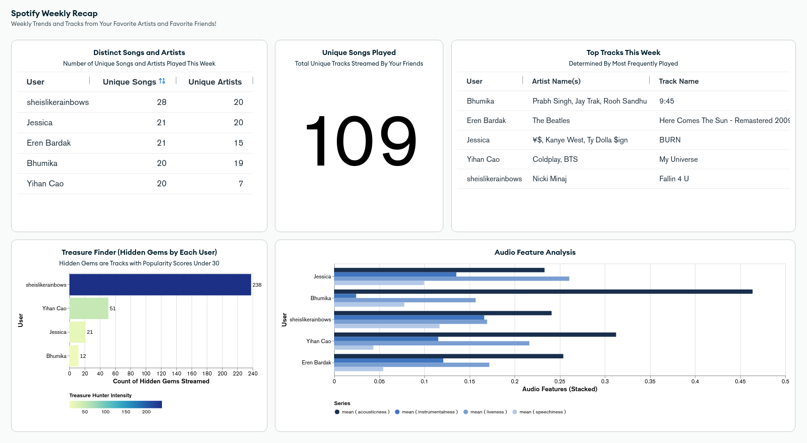

# Distributed Data Processing with Apache Airflow, MongoDB, and SparkSQL

**Tech Stack:** Apache Airflow, Google Cloud Platform, MongoDB Atlas, Python, SparkSQL, Spotify API.

> ## Initital Proposal:
> 
> *Develop a data pipeline in Airflow that can be used to build an application to work as a localized social media platform for small groups of friends. The application will allow users to connect their Spotify accounts and share their listening history. We perform analytics on the data to determine who listened to what the most, and who listened to the same songs the most, and other analytics based on the original datasets.*

### Approach / Tentative Outline

1. Use the script to connect to the Spotify API and collect data user's in a friend group.
2. Load the data into Google Cloud Storage (GCS)
3. Import the data into MongoDB in a collection, we can use the `pymongo` library to interact with MongoDB.
4. Create new datasets from analytical data such user's favorite artists, songs, etc. based on the original datasets.
5. Store the aggregates in a separate collection in MongoDB (`pymongo`) on MongoDB Atlas (cloud-based MongoDB service).
6. Query the data using MongoDB / NoSQL queries.
7. Create Dataframes from the data from MongoDB Atlas.
8. Run SparkSQL queries (Dataproc Cluster) over the data frames.
9. (Optional) Use a recommendation system to recommend songs to users based on their group listening history, via SparkSQL / SparkML.
10. Refresh a dashboard with the latest data from MongoDB Atlas, using Flask and Jinja2 (Future)

### Formative Steps

Use Airflow to orchestrate the following tasks via CRON jobs or other scheduling methods:

  <kbd></img></kbd>

<em>Figure 1: Workflow Graph from the Airflow UI on Google Composer</a></em>

## Prerequisite: Connect to Spotify API for data collection

There is a library in Python called [Spotipy](https://spotipy.readthedocs.io/en/2.22.1/) that can be used to connect to the Spotify API. This is a lightweight Python library for the Spotify Web API. It includes support for all the features of the Spotify Web API including access to all end points, and support for user authorization.

The access token is a string which contains the credentials and permissions that can be used to access a given resource (e.g artists, albums or tracks) or user's data (e.g your profile or your playlists). Your application requests authorization to access service resources from the user and the service then issues access tokens to the application. Note that the access token is valid for 1 hour (3600 seconds). After that time, the token expires and you need to request a new one.

We were able to avoid having to re-authenticate every 60 days though the implementation of an  [Authorization Code Flow](https://developer.spotify.com/documentation/web-api/tutorials/code-flow). By using `Oauth2` authorization,
a refresh token is returned along with the access token. The refresh token is used to get a new access token when it expires.

#### A Note on Security Considerations:

*Credentials (in our case client ID, client secret, access, and refresh tokens) should always be securely stored to prevent unauthorized access. We used the `os` library to store these credentials as environment variables, and accessed them in our scripts without the need to hardcode them.*

## Step 1: Use the script to connect to the Spotify API and collect data

  <kbd></img></kbd>

<em>Figure 2: Glimpse of the DAG</a></em>

## Step 2: Set Up Google Cloud Composer Environment and MongoDB Cluster

After connecting to the Spotify API, we created a Google Cloud account, set up an environment in Google Cloud Composer, and defined the necessary libraries. Additionally, we established a MongoDB Atlas cluster to store the data retrieved from Spotify, preparing for a script-based data upload.
As a first step for running scripts through Google Cloud Composer, we uploaded our scripts into a bucket and using GCC we downloaded the scripts from the bucket into the Airflow environment inside of GCC for them to be able to run during the DAG.

## Step 3: Implement MongoDB Script Workflows in Google Cloud Composer

  <kbd></img></kbd>

<em>Figure 3: MongoDB Script Workflow</a></em>

Then, we uploaded the scripts in Figure 3 to Google Cloud Composer to set up the automated data pipeline. The process starts with the `data_fetcher.py` script, which is the starting point for data retrieval and then triggering other scripts for specific tasks after completion. The whole pipeline is as follows:
1. The Data Fetcher script (`data_fetcher.py`) is first, connecting to Spotify's API to pull user data, ensuring that the data is fetched accurately and efficiently, handling any API limitations or data paging requirements. This also includes account access approval for all members in group.
2. Once the Spotify data is retrieved, the workflow advances to processing with `recently_played_json_converter.py` and `top_tracks_json_converter.py`. These scripts convert song durations to minutes:seconds, align timestamps to Pacific Time, and reformat the data for ease of analysis, discarding irrelevant market data. 
3. The `data_upload.py` script connects and uploads the data to a MongoDB Atlas cluster, forming two main collections: rawdata_recentlyplayed and rawdata_toptracks.
4. Further refinement is done by `create_collections_recently_played.py` and  `create_collections_top_tracks.py`, establishing specialized MongoDB collections to facilitate various analyses. These schemas capture song metadata, track details, album information, artist data, and images, with specific collections like **t50_artists**, **t50_Images**, and **t50_Tracks** for top tracks' data.  

This streamlined workflow in Google Cloud Composer ensures a consistent, automated process for data handling, setting the stage for advanced analytics.

  <kbd></img></kbd>

<em>Figure 4: Screenshot of the Google Cloud Composer</a></em>

## Step 4: Integrate PySpark and MongoDB for Data Visualization

  <kbd></img></kbd>

<em>Figure 5: Grid View of the DAG runs</a></em>

1. **Upload MongoDB Collections to Google Cloud Storage (GCS)**: In this initial phase, the integration process is initiated through a Directed Acyclic Graph (DAG) script. The script serves as an orchestrator, delineating tasks and dependencies for a streamlined workflow. After connecting to MongoDB and extracting relevant data from specified collections, the script seamlessly uploads the dataset to Google Cloud Storage (GCS). This step ensures the data's accessibility for subsequent PySpark processing tasks, fostering a cohesive data flow across the cloud ecosystem.

2. **Run PySpark Job on Dataproc Cluster and Save Visualization to GCS**: Following the data upload to GCS, the workflow progresses to leverage PySpark and Dataproc for advanced data processing and visualization. Initially, a Dataproc cluster is dynamically created using the `google-cloud-dataproc` library, configuring parameters like instance count and types. Subsequently, a PySpark job is submitted to the cluster, executing data processing tasks. The resulting visualizations are saved back to GCS, ensuring the persistence of valuable insights. Finally, the Dataproc cluster is automatically deleted, optimizing resource usage and enhancing cost efficiency in the cloud environment. This comprehensive workflow seamlessly integrates MongoDB, PySpark, and Google Cloud Storage for efficient data handling and visualization in a distributed computing setting.

Use PySpark's powerful data processing capabilities combined with MongoDB's storage to craft dynamic dashboards and visualizations.

  <kbd></img></kbd>

<em>Figure 6: Analyzing the Evolution of Authors' Soundscapes: Unveiling Insights from Track Histories and Audio Features</a></em>

## The Finished Product: A Dynamic Dashboard for Music Insights

We implemented a fully automated data pipeline was created in Apache Airflow, leveraging Google Cloud Composer, MongoDB Atlas, and PySpark for distributed data processing. As a result, we were able to create an interactive dashboard using MongoDB Atlas Charts which visualizes the listening history of users in a friend group, providing insights into their music preferences and listening habits.

  <kbd></img></kbd>

<em>Figure 7: A Dynamic Dashboard To Share Music Taste with Friends</a></em>
</a></em>

